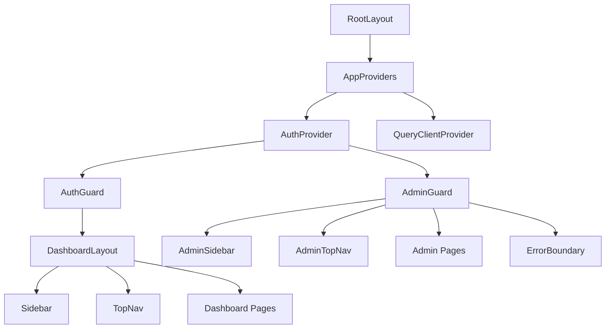

# ISHAARA Web Dashboard — Architecture Document

> **Version:** 1.0.0
> **Last Updated:** 2025-10-02
> **Phase:** A24 — Production Documentation & Engineering Handoff
> **Status:** CONDITIONAL — EXTERNAL DEPENDENCY REMAINS (`BACKEND-AUTH-CORS-001`)

---

## 1. System Overview

The ISHAARA Web Dashboard is a **Next.js 16.3.8** application serving as the
administrative and agency-owner operations console for the ISHAARA Mobility
Platform.  It provides:

- **Agency Owner Dashboard** — Fleet management, driver memberships, vehicle
  assignments, trip monitoring, settlement visibility.
- **Platform Admin Console** — Financial settlement processing, batch
  operations, reconciliation audits, and system health monitoring.

### 1.1 High-Level Diagram

```
┌──────────────────────────────────────────────────────────────┐
│                     Browser (Client)                        │
│                                                              │
│   ┌─────────────┐  ┌────────────────┐  ┌───────────────┐    │
│   │  AuthContext │  │ Agency Dashboard│  │ Admin Console │    │
│   │  (React)    │  │   Pages/Comps  │  │  Pages/Comps  │    │
│   └──────┬──────┘  └───────┬────────┘  └──────┬────────┘    │
│          │                 │                   │             │
│          └─────────────┬───┘                   │             │
│                        │                       │             │
│               apiClient (Bearer token)         │             │
│                        │                       │             │
└────────────────────────┼───────────────────────┼─────────────┘
                         │                       │
        ┌────────────────┘                       │
        ▼                                        ▼
┌──────────────────┐              ┌───────────────────────────┐
│  Backend API     │              │  Next.js Server (Node.js) │
│  (Render)        │◄─────────────│  /api/admin/* routes      │
│                  │  x-admin-key │  adminProxy.ts            │
│  /api/v1/*       │  injected    │  Session → Role verify    │
│                  │  server-side │  ADMIN_SECRET_KEY (env)    │
└──────────────────┘              └───────────────────────────┘
```

---

## 2. Technology Stack

| Layer               | Technology                        | Version  |
|---------------------|-----------------------------------|----------|
| Framework           | Next.js (App Router)              | 16.3.8   |
| Runtime             | Node.js                           | 22.x     |
| UI Library          | React                             | 19.2.8   |
| Language            | TypeScript                        | ^5       |
| Data Fetching       | TanStack React Query              | ^5.104   |
| Styling             | Tailwind CSS v4                   | ^4       |
| Icons               | Lucide React                      | ^1.49    |
| Testing             | Vitest + Testing Library + jsdom  | ^5.0.3   |
| Linting             | ESLint + eslint-config-next       | ^9       |
| CSS Processing      | PostCSS + @tailwindcss/postcss    | ^4       |

---

## 3. Directory Structure

```
ishara-web-dashboard/
├── src/
│   ├── app/                          # Next.js App Router pages & API routes
│   │   ├── layout.tsx                # Root layout (AppProviders)
│   │   ├── page.tsx                  # Landing / redirect
│   │   ├── globals.css               # Global Tailwind imports
│   │   ├── login/page.tsx            # Authentication page
│   │   ├── unauthorized/page.tsx     # Access denied page
│   │   ├── dashboard/                # Agency Owner dashboard (AuthGuard)
│   │   │   ├── layout.tsx            # DashboardLayout wrapper
│   │   │   ├── page.tsx              # Dashboard home
│   │   │   ├── assignments/          # Driver-vehicle assignments
│   │   │   ├── drivers/              # Driver management (list + [id])
│   │   │   ├── operations/           # Operational overview
│   │   │   ├── settings/             # Agency settings
│   │   │   ├── settlements/          # Agency settlement view (list + [id])
│   │   │   ├── trips/                # Trip management
│   │   │   └── vehicles/             # Vehicle management (list + [id])
│   │   ├── admin/                    # Platform Admin console (AdminGuard)
│   │   │   ├── layout.tsx            # AdminGuard + AdminSidebar + ErrorBoundary
│   │   │   ├── page.tsx              # Admin home / SystemHealthStatus
│   │   │   ├── reconciliation/       # Reconciliation audit console
│   │   │   └── settlements/          # Settlement mutation console (list + [id])
│   │   └── api/                      # Server-side API routes
│   │       ├── health/route.ts       # Liveness + readiness probe
│   │       └── admin/settlements/    # Admin proxy routes (7 endpoints)
│   ├── components/
│   │   ├── admin/                    # Admin-specific components
│   │   ├── layout/                   # Layout guards, sidebars, nav
│   │   ├── providers/                # AppProviders (AuthProvider + QueryClient)
│   │   └── ui/                       # Shared UI primitives
│   ├── lib/
│   │   ├── api/                      # Client-side API modules
│   │   │   ├── client.ts             # Base HTTP client + auth storage
│   │   │   ├── auth.ts               # Auth API (login, logout, getCurrentUser)
│   │   │   ├── agencies.ts           # Agency CRUD
│   │   │   ├── memberships.ts        # Membership operations
│   │   │   ├── settlements.ts        # Settlement API (operator + admin)
│   │   │   ├── trips.ts              # Trip queries
│   │   │   ├── vehicles.ts           # Vehicle operations
│   │   │   └── index.ts              # Barrel export
│   │   ├── auth/AuthContext.tsx       # React auth context + session management
│   │   ├── errors/index.ts           # ApiError class + sanitized formatting
│   │   ├── server/
│   │   │   ├── adminProxy.ts         # Server-side admin proxy (x-admin-key)
│   │   │   └── logger.ts             # Structured JSON logging + redaction
│   │   └── utils.ts                  # Shared utility functions
│   └── types/
│       ├── index.ts                  # Core domain types
│       └── settlement.ts             # Settlement-specific types
├── tests/                            # Vitest test suite (17 test files)
├── docs/                             # Production documentation (this directory)
├── next.config.ts                    # Security headers, CSP
├── package.json                      # Dependencies and scripts
├── tsconfig.json                     # TypeScript configuration
├── vitest.config.ts                  # Test configuration
├── .env.example                      # Environment variable template
└── .env.local                        # Local environment overrides
```

---

## 4. Architectural Layers

### 4.1 Presentation Layer (Client)

- **React 19** components rendered via Next.js App Router
- **AuthContext** provides centralized session state (`user`, `isAdmin`,
  `isAgencyOwner`, `activeAgency`)
- **Route Guards**: `AuthGuard` (agency owner pages) and `AdminGuard`
  (admin console) enforce role-based UI access
- **TanStack React Query** handles data fetching, caching, and refetching

### 4.2 API Client Layer

- [`src/lib/api/client.ts`](file:///home/dev/ishara-web-dashboard/src/lib/api/client.ts):
  Centralized `request()` function with:
  - Automatic `Bearer` token injection from `authStorage`
  - 15-second abort timeout
  - Structured `ApiError` propagation
  - Internal API routing: `/api/admin/*` → same-origin Next.js server

### 4.3 Server-Side Proxy Layer

- [`src/lib/server/adminProxy.ts`](file:///home/dev/ishara-web-dashboard/src/lib/server/adminProxy.ts):
  The central admin operations proxy that:
  1. Extracts `Authorization` header from incoming request
  2. Verifies session via `GET /api/v1/users/me` on the backend
  3. Confirms `role === "ADMIN"`
  4. Injects `x-admin-key` from `ADMIN_SECRET_KEY` env var
  5. Forwards to upstream backend
  6. Emits structured JSON logs for every operation

### 4.4 Observability Layer

- [`src/lib/server/logger.ts`](file:///home/dev/ishara-web-dashboard/src/lib/server/logger.ts):
  - JSON-structured logs to stdout/stderr
  - Automatic `redactSensitiveData()` scrubbing of secrets, bearer tokens,
    database URIs, and internal IPs
  - Request correlation via `X-Request-ID` headers
- [`src/app/api/health/route.ts`](file:///home/dev/ishara-web-dashboard/src/app/api/health/route.ts):
  - **Liveness**: `GET /api/health` — instant response
  - **Readiness**: `GET /api/health?full=true` — includes backend dependency check

---

## 5. Security Architecture

### 5.1 Authentication Flow

```
Browser                    Next.js Server              Backend API
  │                             │                          │
  │  (1) User enters token      │                          │
  │  on /login page             │                          │
  │                             │                          │
  │  (2) GET /api/v1/users/me   │                          │
  │  ─────────────────────────────────────────────────────►│
  │                             │         (3) 200 + User   │
  │  ◄─────────────────────────────────────────────────────│
  │                             │                          │
  │  (4) AuthContext stores     │                          │
  │  token + user state         │                          │
  │                             │                          │
```

- Tokens stored in `localStorage` + `inMemoryToken` (dual-layer)
- Session restoration on page load via `restoreSession()`
- Token cleared on 401 responses

### 5.2 Admin Authorization (Server-Side)

```
Browser                    Next.js /api/admin/*          Backend API
  │                             │                          │
  │  POST /api/admin/           │                          │
  │  settlements/{id}/process   │                          │
  │  Authorization: Bearer xxx  │                          │
  │  ────────────────────────► │                          │
  │                             │                          │
  │                    (1) verifyAdminSession()             │
  │                    GET /api/v1/users/me                 │
  │                    with Bearer xxx ──────────────────► │
  │                                       200 {role:ADMIN} │
  │                    ◄───────────────────────────────────│
  │                             │                          │
  │                    (2) role === "ADMIN" ✓               │
  │                             │                          │
  │                    (3) inject x-admin-key               │
  │                    from ADMIN_SECRET_KEY                │
  │                             │                          │
  │                    (4) Forward to upstream              │
  │                    POST /api/v1/payments/...            │
  │                    ─────────────────────────────────► │
  │                             │               200 result │
  │                    ◄───────────────────────────────────│
  │                             │                          │
  │  ◄──────────────────────── │                          │
  │       200 result            │                          │
```

**Key security invariants:**
- `ADMIN_SECRET_KEY` is **server-only** (no `NEXT_PUBLIC_` prefix)
- `x-admin-key` is **never** sent by the browser
- Role verification happens on **every** admin API call
- 30-second in-memory role cache prevents auth amplification
- Non-admin roles are cached to block privilege escalation brute force

### 5.3 Security Headers

Enforced via [`next.config.ts`](file:///home/dev/ishara-web-dashboard/next.config.ts):

| Header                    | Value                                          |
|---------------------------|------------------------------------------------|
| X-Content-Type-Options    | `nosniff`                                      |
| X-Frame-Options           | `DENY`                                         |
| Referrer-Policy           | `strict-origin-when-cross-origin`              |
| Strict-Transport-Security | `max-age=31536000; includeSubDomains; preload` |
| Permissions-Policy        | `camera=(), microphone=(), geolocation=()`     |
| Content-Security-Policy   | `default-src 'self'; connect-src 'self' https://reposnse-ishaara.onrender.com; frame-ancestors 'none'` |

### 5.4 Error Sanitization

- [`src/lib/errors/index.ts`](file:///home/dev/ishara-web-dashboard/src/lib/errors/index.ts):
  `sanitizeMessage()` strips secrets, internal IPs, stack traces, database URIs
  from any error message before it reaches the UI
- Server logs run through `redactSensitiveData()` before emission

---

## 6. Role-Based Access Control (RBAC)

| Role              | Dashboard | Admin Console | Settlement Mutations | Backend API |
|-------------------|-----------|---------------|----------------------|-------------|
| `USER`            | ✗ (→ /unauthorized) | ✗         | ✗                    | Read-only   |
| `DRIVER_CONDUCTOR`| ✗ (→ /unauthorized) | ✗         | ✗                    | Limited     |
| `AGENCY_OWNER`    | ✓         | ✗             | ✗ (view-only)        | Agency-scoped |
| `ADMIN`           | ✓         | ✓             | ✓ (full control)     | Platform-wide |

### Guard Components

- [`AuthGuard`](file:///home/dev/ishara-web-dashboard/src/components/layout/AuthGuard.tsx):
  Blocks `USER` / `DRIVER_CONDUCTOR` from `/dashboard/*`
- [`AdminGuard`](file:///home/dev/ishara-web-dashboard/src/components/layout/AdminGuard.tsx):
  Blocks all non-`ADMIN` users from `/admin/*`

---

## 7. Data Flow — Settlement Processing

```
Agency Owner                              Platform Admin
     │                                         │
     │  View settlements                       │  Process / Retry / Reconcile
     │  GET /api/v1/operators/{id}/settlements  │  POST /api/admin/settlements/{id}/process
     │  ─────────────────────────────►          │  ────────────────────────────────►
     │  Direct to backend                       │  Through adminProxy.ts
     │  (no admin key)                          │  (x-admin-key injected server-side)
     │                                          │
```

### Settlement State Machine

```
NOT_READY ──► PENDING ──► PROCESSING ──► PROCESSED
                │                           │
                │                           ▼
                └──────── FAILED ◄──── RECONCILING
                             │
                             ▼
                         (RETRY)
```

---

## 8. Known External Dependencies

### 8.1 Backend API (Render)

| Attribute        | Value                                      |
|------------------|--------------------------------------------|
| Base URL         | `https://reposnse-ishaara.onrender.com`    |
| Auth             | Better Auth (session tokens)               |
| Payments         | Razorpay Route (settlement payouts)        |
| Health Check     | `GET /api/v1/users/me` (status probe)      |

### 8.2 BACKEND-AUTH-CORS-001 (OPEN)

| Attribute   | Detail                                                |
|-------------|-------------------------------------------------------|
| Issue ID    | `BACKEND-AUTH-CORS-001`                               |
| Severity    | **HIGH**                                              |
| Endpoint    | `POST /api/auth/email-otp/send-verification-otp`      |
| Symptom     | HTTP 500 on CORS preflight                            |
| Impact      | OTP-based login flow is non-functional                |
| Workaround  | Direct session token entry on `/login` page           |
| Owner       | Backend / Better Auth team                            |
| Status      | **OPEN** — awaiting upstream fix                      |

---

## 9. Testing Architecture

- **Framework:** Vitest 5.x with jsdom environment
- **Test Files:** 17 test suites in `/tests/`
- **Coverage Areas:**
  - Admin authorization & role verification
  - Settlement ID validation & input security
  - Admin secret isolation (no client bundle leakage)
  - Concurrent mutation protection (409 handling)
  - Reconciliation audit integrity
  - Observability infrastructure (logging, health, correlation)
  - Production UAT E2E workflows
- **Execution:** `npm test` (all 103+ assertions)

---

## 10. Build & Deployment

### 10.1 Build Pipeline

```bash
npm run build          # Production build (Next.js static + server)
npm run start          # Production server (port 3000)
npm run dev            # Development server with HMR
npm run lint           # ESLint validation
npm run typecheck      # TypeScript type checking
npm test               # Vitest test execution
```

### 10.2 Required Environment Variables

| Variable                   | Scope     | Required | Description                      |
|----------------------------|-----------|----------|----------------------------------|
| `NEXT_PUBLIC_API_BASE_URL` | Client    | Yes      | Backend API base URL             |
| `ADMIN_SECRET_KEY`         | Server    | Yes*     | Admin operations secret key      |
| `INTERNAL_API_BASE_URL`    | Server    | No       | Override for internal routing     |

\* Required for admin settlement operations. Dashboard functions without it.

---

## Appendix A: Component Dependency Graph


